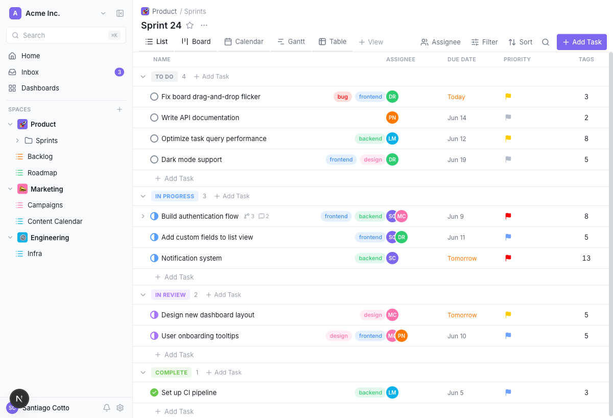
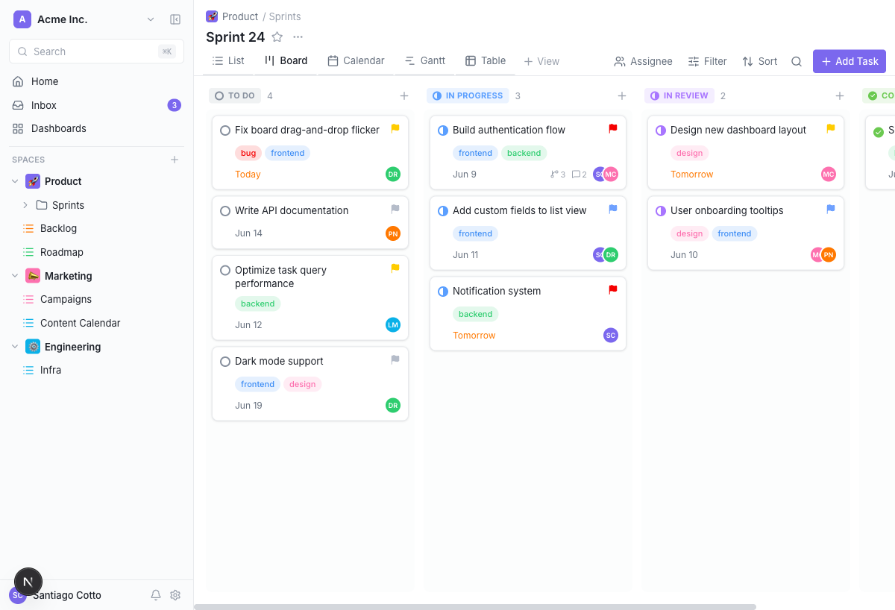
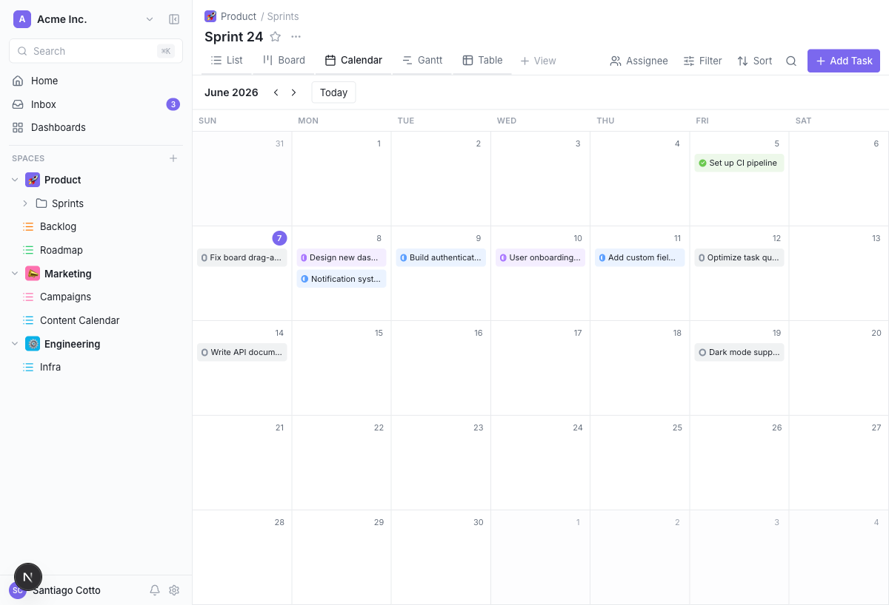
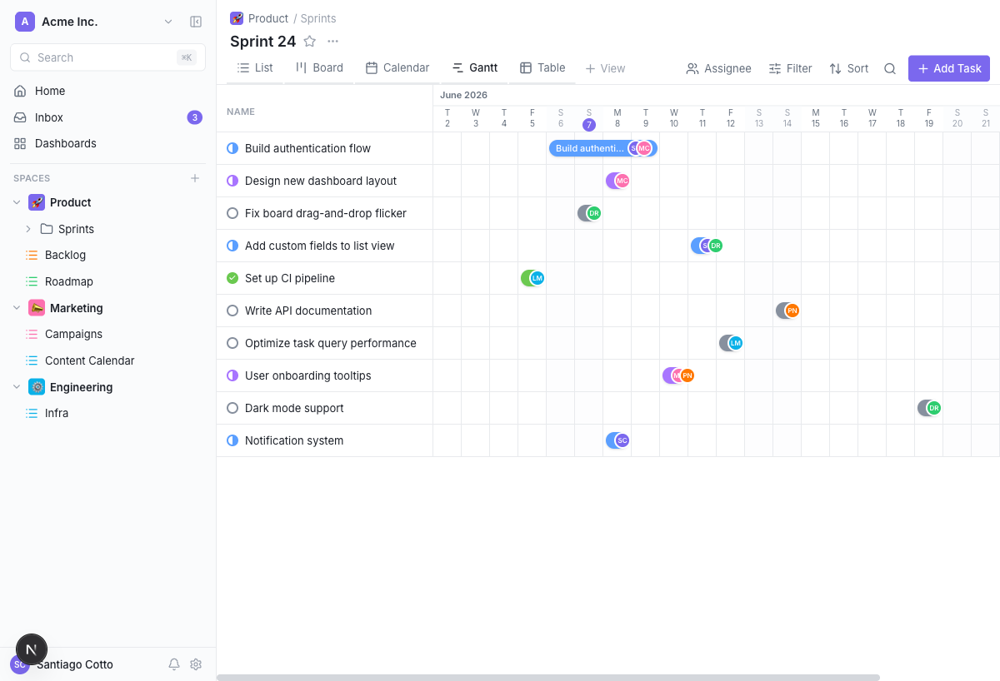
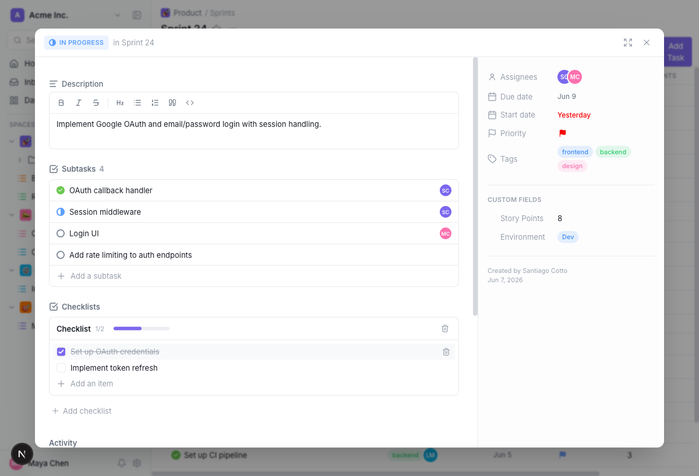
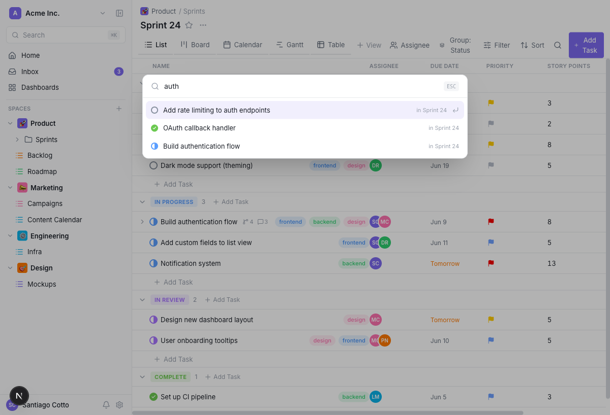
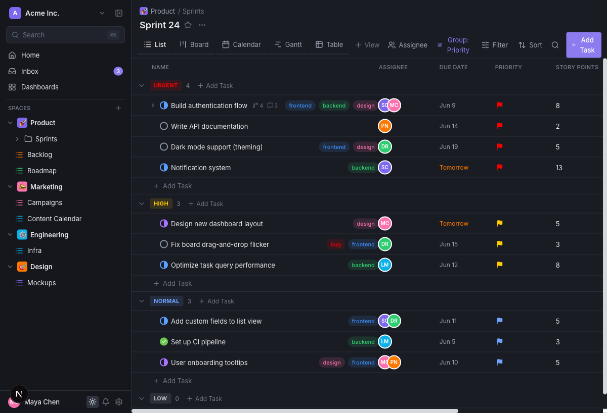

# Open ClickUp

**An open-source, self-hostable ClickUp clone** — project & task management with the full hierarchy, five views, custom fields, real-time-friendly UX, and dark mode. Built with Next.js 16, React 19, Prisma 7 and Postgres.

> ⚠️ Unofficial, educational project. Not affiliated with or endorsed by ClickUp. It re-creates the *management* UX (no AI features) as a learning/reference codebase.



---

## ✨ Features

**Hierarchy** — Workspaces → Spaces → Folders → Lists → Tasks → Subtasks, with inline create / rename / delete in the sidebar.

**5 views** (per list, each with its own saved config):
- **List** — grouped, inline-editable, drag-to-reorder, custom-field columns
- **Board** — Kanban with drag-and-drop between columns
- **Calendar** — month grid, tasks on their due dates
- **Gantt** — timeline with start→due bars
- **Table** — spreadsheet-style grid

**Tasks** — rich-text description & comments (with **@mentions**), custom statuses, priorities, multiple assignees, start/due dates (calendar picker), tags, **custom fields** (text, number, dropdown, labels, date, checkbox, rating…), subtasks, **checklists**, activity log.

**Productivity** — filter / sort / **group-by** (status · assignee · priority) across every view, **⌘K command palette** search, **multi-select + bulk actions**, status workflow editor, **dark mode**.

**Production-minded** — real email/password **auth with sessions** (scrypt-hashed), **Zod-validated** API with consistent errors, role model, render-capped large lists.

| Board | Calendar | Gantt |
|---|---|---|
|  |  |  |

| Task detail | Command palette (⌘K) | Dark mode |
|---|---|---|
|  |  |  |

---

## 🧰 Tech stack

| Layer | Choice |
|---|---|
| Framework | [Next.js 16](https://nextjs.org) (App Router, Turbopack) · React 19 |
| Language | TypeScript |
| Styling | Tailwind CSS 4 (ClickUp-style design tokens) |
| Database | PostgreSQL + [Prisma 7](https://www.prisma.io) (pg driver adapter) |
| Data fetching | TanStack Query (optimistic updates) |
| Drag & drop | dnd-kit |
| UI primitives | Radix UI |
| Rich text | Tiptap |
| Validation | Zod |

---

## 🚀 Getting started

**Prerequisites:** Node 20+, pnpm, Docker (for Postgres).

```bash
# 1. Install dependencies
pnpm install

# 2. Start Postgres (localhost:5544)
docker compose up -d

# 3. Set up the database + seed demo data
cp .env.example .env
pnpm prisma migrate dev
pnpm db:seed

# 4. Run the dev server
pnpm dev
```

Open **http://localhost:3000** and log in with the seeded demo account:

```
email:    santiago@clickuppp.dev
password: password
```

(All seeded users use the password `password`; or click **Sign up** to create your own.)

---

## 📜 Scripts

| Script | Description |
|---|---|
| `pnpm dev` | Start the dev server (Turbopack) |
| `pnpm build` / `pnpm start` | Production build / serve |
| `pnpm db:seed` | Seed sample workspace, users, spaces, tasks |
| `pnpm db:reset` | Reset the database and re-seed |
| `pnpm db:studio` | Open Prisma Studio |
| `pnpm lint` | Lint |

---

## 🗂️ Project structure

```
app/
  (app)/            # authenticated app shell + routes (list pages)
  login/            # login / signup page
  api/              # REST route handlers (Zod-validated)
components/
  views/            # list · board · calendar · gantt · table + filters
  menus/            # status · priority · assignee · date · tag controls
  task/             # task modal + checklists
  sidebar/          # workspace navigation tree
  ui/               # avatars, rich editor, primitives, theme toggle
lib/
  db.ts             # Prisma client (pg adapter)
  auth.ts           # sessions + scrypt passwords
  queries.ts        # shared include shapes + payload types
  grouping.ts       # group-by logic
  view-state.ts     # filters / sort / group-by
prisma/
  schema.prisma     # data model
  seed.ts           # demo data
```

---

## 🗺️ Roadmap

Done: hierarchy CRUD · 5 views · custom fields · checklists · comments + @mentions · filter/sort/group · ⌘K search · multi-select/bulk · status editor · dark mode · auth + sessions · Zod validation.

Planned: real-time collaboration (SSE/WebSockets) · automated tests · notifications/Inbox · attachments · time tracking · task dependencies · role-based permission enforcement · list virtualization.

See [CONTRIBUTING.md](CONTRIBUTING.md) — PRs welcome!

---

## 📄 License

[MIT](LICENSE) © contributors. ClickUp® is a trademark of its respective owner; this project is an independent, unofficial clone for educational purposes.
