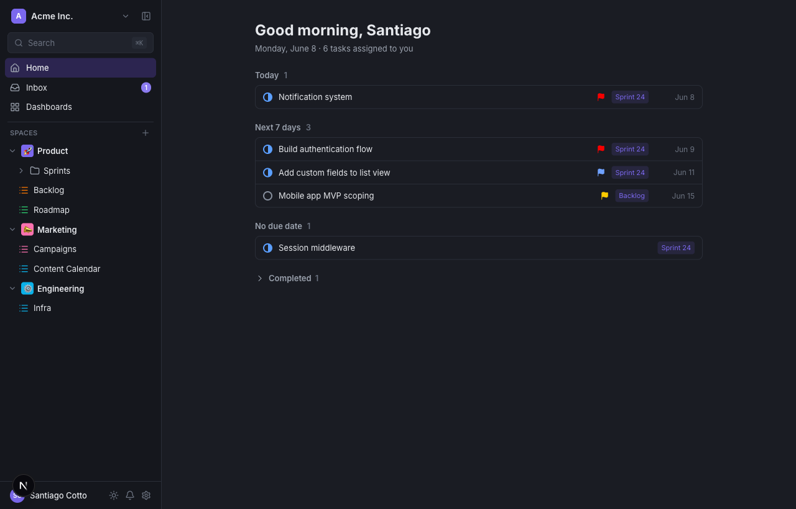

<div align="center">

# Open ClickUp

**The open-source, self-hostable project management platform.**

Hierarchy, five views, custom fields, real-time collaboration and dark mode — own your data, no per-seat pricing.

[](https://github.com/goshops-com/open-clickup/actions/workflows/ci.yml)
[](LICENSE)


[](CONTRIBUTING.md)

</div>


---

## Why Open ClickUp

- **Self-hostable** — run it on your own infrastructure with a single Postgres database. Your data stays yours.
- **No per-seat pricing** — invite the whole team; it's MIT-licensed and free.
- **Familiar, fast UX** — the workflows you already know (lists, boards, sprints) with instant, optimistic interactions and live updates.
- **Hackable** — a clean, modern, fully-typed codebase you can extend or embed.

## ✨ Features

**Hierarchy** — Workspaces → Spaces → Folders → Lists → Tasks → Subtasks, with inline create / rename / delete.

**5 views** (per list, each with its own saved configuration):
- **List** — grouped, inline-editable, drag-to-reorder, custom-field columns
- **Board** — Kanban with drag-and-drop, collapsible columns, WIP limits
- **Calendar** — month & week views, drag tasks to reschedule
- **Gantt** — timeline with start→due bars you can drag/resize, plus dependency arrows
- **Table** — spreadsheet-style grid with multi-select

**Tasks** — rich-text descriptions, custom statuses, priorities, multiple assignees, start/due dates, tags, **custom fields** (text, number, dropdown, labels, date, checkbox, rating…), subtasks, **checklists**, **time tracking** (estimates + live timer), **dependencies** (waiting-on / blocking), **recurring** tasks, **file attachments**, watchers, duplicate, and move-between-lists.

**Collaboration** — threaded **comments** with **@mentions**, emoji reactions, edit/delete and resolve; an **Inbox** with notifications (mentions, assignments, comments); a per-task **activity timeline**; and live updates over SSE.

**Productivity** — filter / sort / **group-by** (status · assignee · priority) on every view, a **⌘K command palette**, keyboard shortcuts, **multi-select + bulk actions**, **task templates**, **favorites**, a "My Work" home, a status-workflow editor, **dark mode**, and a mobile-responsive layout.

**Built to run in production** — email/password **auth with server-side sessions** (scrypt-hashed), **role-based permissions**, a fully **Zod-validated** API, security headers + auth rate limiting, a `/api/health` probe, a one-command **Docker** self-host, and unit + e2e tests in CI.



| Board | Calendar | Gantt (with dependencies) |
|---|---|---|
|  |  |  |

| Task detail | Command palette (⌘K) | Dark mode |
|---|---|---|
|  |  |  |

---

## 🧰 Tech stack

| Layer | Choice |
|---|---|
| Framework | [Next.js 16](https://nextjs.org) (App Router, Turbopack) · React 19 |
| Language | TypeScript |
| Styling | Tailwind CSS 4 |
| Database | PostgreSQL + [Prisma 7](https://www.prisma.io) (pg driver adapter) |
| Data fetching | TanStack Query (optimistic updates) |
| Realtime | Server-Sent Events |
| Drag & drop | dnd-kit |
| UI primitives | Radix UI |
| Rich text | Tiptap |
| Validation | Zod |

---

## 🚀 Getting started

**Prerequisites:** Node 20+, pnpm, Docker (for Postgres).

```bash
# 1. Install dependencies
pnpm install

# 2. Start Postgres (localhost:5544)
docker compose up -d

# 3. Configure env, run migrations, seed demo data
cp .env.example .env
pnpm prisma migrate dev
pnpm db:seed

# 4. Run the dev server
pnpm dev
```

Open **http://localhost:3000** and log in with the seeded account (or create your own):

```
email:    santiago@clickuppp.dev
password: password
```

## 🐳 Self-hosting

**Docker (app + database, one command):**

```bash
docker compose -f docker-compose.prod.yml up --build
# → http://localhost:3000  (migrations run automatically on boot)

# optional: load sample data
docker compose -f docker-compose.prod.yml exec app pnpm db:seed
```

**Or run the Node server directly:**

```bash
pnpm build && pnpm start
```

Set `DATABASE_URL` to your Postgres instance and run `pnpm prisma migrate deploy` on deploy. The app runs anywhere Node 20+ runs (a VM, a container, or any Node host); point it at a managed or self-run Postgres. Real-time uses in-process pub/sub — for multiple instances behind a load balancer, swap it for Redis pub/sub (see `lib/events.ts`).

A `GET /api/health` endpoint returns `200` when the database is reachable (`503` otherwise) for load-balancer and uptime checks; the Docker app container uses it as its healthcheck.

---

## 📜 Scripts

| Script | Description |
|---|---|
| `pnpm dev` | Start the dev server (Turbopack) |
| `pnpm build` / `pnpm start` | Production build / serve |
| `pnpm db:seed` | Seed sample workspace, users, spaces, tasks |
| `pnpm db:reset` | Reset the database and re-seed |
| `pnpm db:studio` | Open Prisma Studio |
| `pnpm lint` | Lint |

---

## 🗂️ Project structure

```
app/
  (app)/            # authenticated app shell + routes (list pages)
  login/            # login / signup page
  api/              # REST route handlers (Zod-validated) + SSE stream
components/
  views/            # list · board · calendar · gantt · table + filters
  menus/            # status · priority · assignee · date · tag controls
  task/             # task modal + checklists
  sidebar/          # workspace navigation tree
  ui/               # avatars, rich editor, primitives, theme toggle
lib/
  db.ts             # Prisma client (pg adapter)
  auth.ts           # sessions + scrypt passwords
  events.ts         # realtime pub/sub
  queries.ts        # shared include shapes + payload types
  grouping.ts       # group-by logic
  view-state.ts     # filters / sort / group-by
prisma/
  schema.prisma     # data model
  seed.ts           # demo data
```

---

## 🗺️ Roadmap

**Shipped** — hierarchy CRUD · 5 views · custom fields · checklists · comments + @mentions · filter/sort/group · ⌘K search · multi-select & bulk actions · status editor · dark mode · auth + sessions · real-time · Zod-validated API.

**Next up** — automated test suite · notifications / Inbox · file attachments · time tracking · task dependencies · role-based permissions · list virtualization.

Contributions are welcome — see [CONTRIBUTING.md](CONTRIBUTING.md).

---

## 📄 License

[MIT](LICENSE) © Santiago Cotto and contributors.

<sub>ClickUp® is a trademark of its respective owner; this is an independent project and is not affiliated with or endorsed by ClickUp.</sub>
